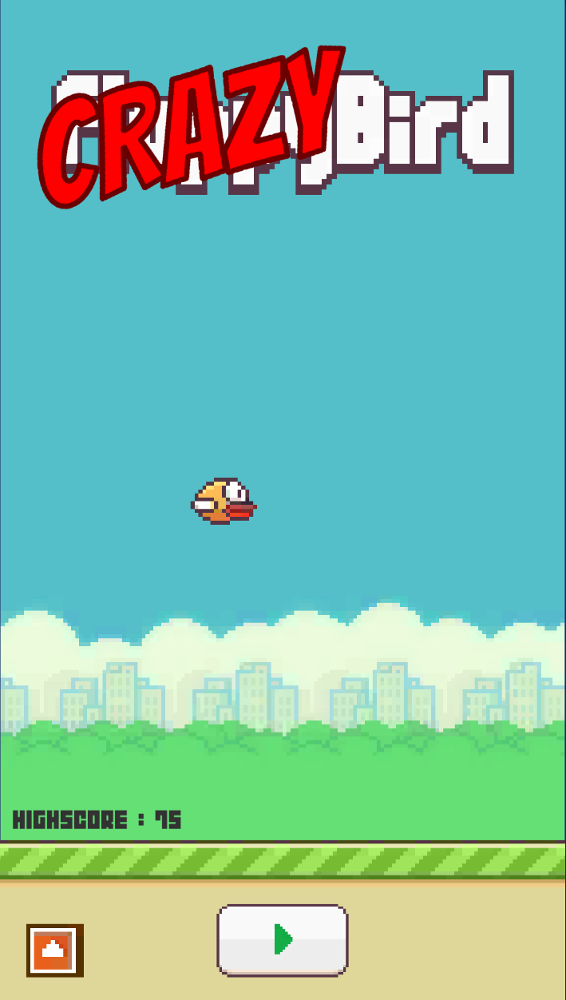
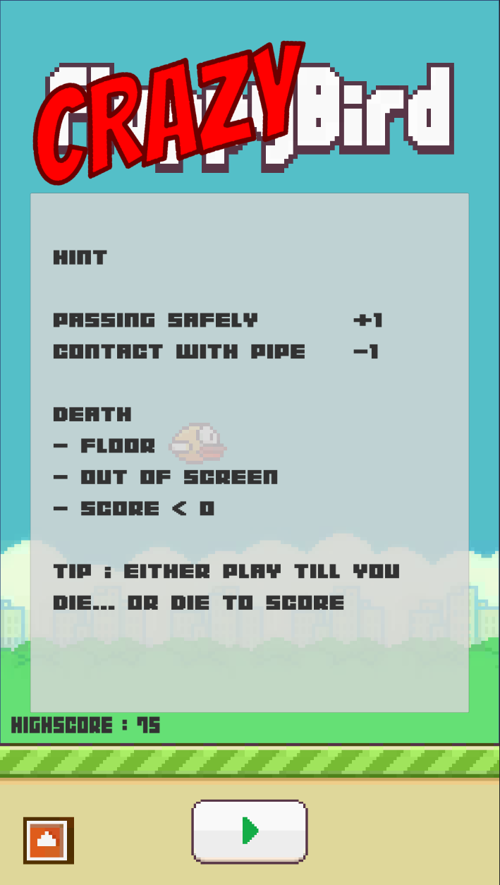
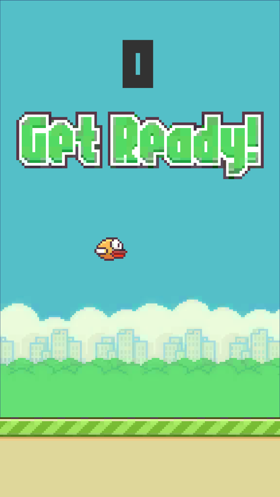
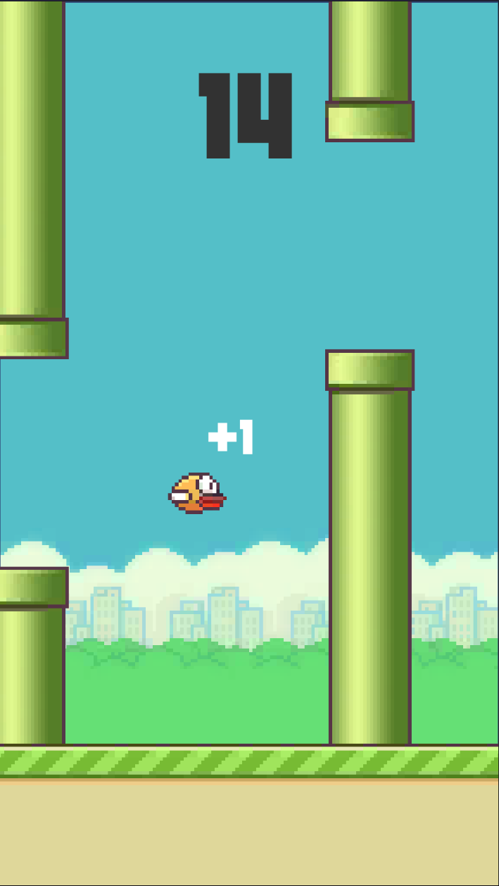
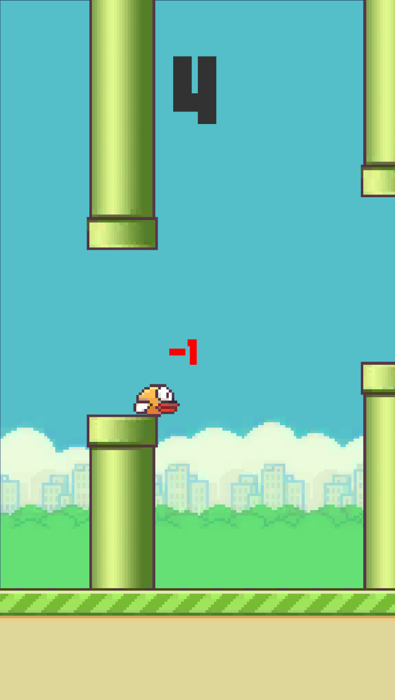
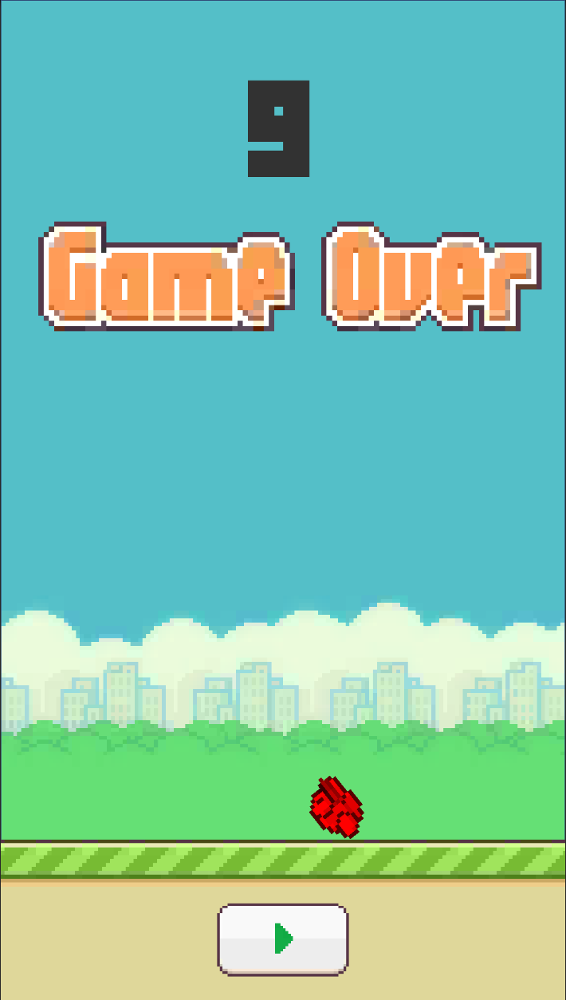

# CrazyBirdGame-Unity
This is a game made with unity and flappy bird assets. In this have to pass the pipe without hitting them.
The aim of this game is to hit as much score as you can and die. or else your score will keep on reducing till you die with score zero. 
Either you play till you die or die to score.

# Features
- Mouse click to fly
- Infinte pipe spawning
- Save Highscore
- Hitting pipe decreases score
- Passing pipe increases score
- Score less than zero or hitting floor of out of screen leads to death.
- Slow-motion after death.

# Screenshots

